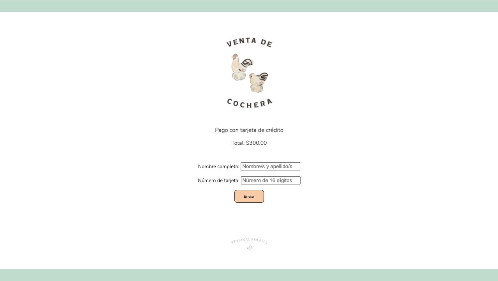
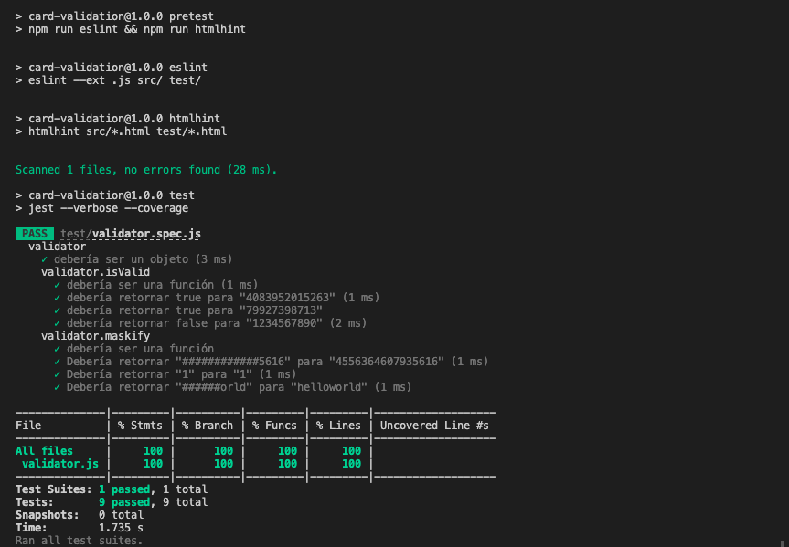

# Validación de tarjeta de crédito para el sitio 'Venta de cochera'

## Sobre Venta de cochera

'Venta de cochera' es un marketplace al que pueden recurrir aquellas personas que no disponen de una cochera para vender los artículos que ya no usan. Ahí es posible anunciar, por $300.00 pesos mexicanos, hasta 10 objetos, cada uno acompañado de un relato biográfico, real o ficticio, que dé cuenta de la relevancia del artículo, tanto utilitaria como personal. Es decir, que la aplicación para validar tarjetas de crédito está dirigida, al menos por ahora, a vendedores y no a compradores.
 

 

* Principales usuarios del producto:

Vendedores: personas que deseen anunciar objetos que ya no usan acompañados de un relato personal, como lo harían si hicieran una venta de cochera, salvo porque no disponen de una en su hogar. Cada vendedor tiene su cochera virtual. La intención es que sea un intercambio idealmente vecinal y que no requiera servicio de mensajería o un traslado largo, sino que baste definir un punto de reunión cercano para ambos vecinos: vendedor y comprador.

* Objetivos de los usuarios en relación con el producto:

Anunciar uno o hasta 10 artículos de segunda mano por $300.00 pesos mexicanos que pagarán a través de la aplicación.

* Cómo resuelve sus problemas el producto:

- Brinda a los usuarios (vendedores) un espacio del que antes no disponían para anunciar sus productos acompañados de un relato personal que añade valor al objeto y enriquece la experiencia de compraventa al volverla más significativa (no es una simple transacción).
- El registro, que supone el pago del espacio para anunciar, es sencillo. Además, pagar con tarjeta en línea siempre será más fácil y práctico que cualquier otro método para servicios en línea.

## Sobre la aplicación

La estructura del sitio, su apariencia y las interacciones fueron diseñadas en HTML, CSS y JavaScript, respectivamente.

La aplicación permite verificar si la tarjeta de crédito de un usuario es válida o no a través del objeto 'validator', cuyas propiedades son las funciones 'isValid' y 'maskify', descritas más adelante. La interfaz cuenta con algunos elementos identitarios, un título descriptivo, el monto a pagar y dos cajas de texto: una para que el usuario registre su nombre y su apellido (sólo admite letras, tildes y espacios) y otra para que introduzca el número de su tarjeta (sólo admite números, sin espacios), además de un botón que llama a las funciones de verificación.

La función 'validate' importa el objeto 'validator'. En primera instancia, determina si los valores ingresados por el usuario son correctos en el sentido de que corresponden a los tipos de datos solicitados (letras, números, etc.). Una vez que se cumplen las condiciones requeridas llama a la función 'isValid', que evalúa si el número de tarjeta es válido. Emite mensajes para el usuario tanto si los valores ingresados son correctos o válidos como si no lo son.

La función 'isValid' toma el argumento 'cardNumber', que representa el número de tarjeta de crédito, y determina si es válido o no utilizando el [algoritmo de Luhn](https://es.wikipedia.org/wiki/Algoritmo_de_Luhn). Finalmente comprueba si es divisible entre 10; si es así, devuelve "true"; de lo contrario, devuelve "false".

La función 'maskify' oculta y reemplaza con numerales (#) los dígitos del número de la tarjeta, excepto los últimos cuatro, cuando la función 'isValid' ha determinado que es válido. De esta manera protege la información confidencial del usuario. Además muestra el logotipo de la franquicia emisora de la tarjeta: Visa o MasterCard.

## Tests

Para combrobar que las funciones más relevantes se comportan según lo previsto, se realizaron pruebas unitarias (tests) que evalúan su desempeño y nos permiten garantizar que no haya errores en su funcionamiento. También nos dejan saber qué porcentaje del código ha sido ejecutado por ellas.

Como se aprecia en la imagen, todas las funciones pasaron las pruebas. Además éstas tienen una cobertura del 100% para sentencias (statements), 100% para ramas (branch), 100% para funciones (functions), y 100% para líneas (lines).

